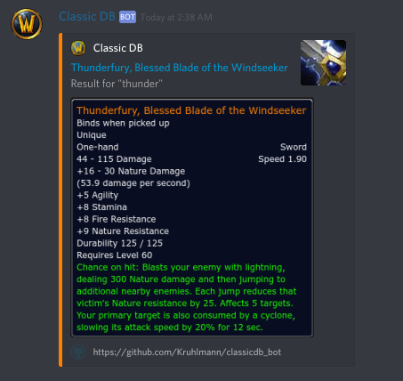

# Classic DB discord bot
*A discord bot for linking vanilla wow 1.12.1 items*

## Setup
To invite the bot press [this link](https://discordapp.com/oauth2/authorize?client_id=545640068056875048&scope=bot&permissions=0) as the server owner. Invite the bot to the server of your choice and, if necessary, promote it to allow for posting in your desired channel(s).

## Usage

To have an item linked simply type the name of the item in square brackets. 
Typing a partial name will result in the first item avaliable being fetched.

As such typing `[thunder]` will result in the following output:

