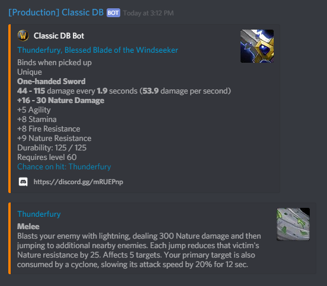

# Classic DB discord bot

## Setup

  

To invite the bot click [this link](https://discordapp.com/oauth2/authorize?client_id=545640068056875048&scope=bot&permissions=0) (or the image above) as the server owner. Invite the bot to the server of your choice and, if necessary, promote it to allow for posting in your desired channel(s).

## Usage

To have an item linked simply type the name of the item in square brackets.
Typing a partial name will result in the first item avaliable being fetched.

As such typing `[thunder]` will result in the following output:

### Local setup

If you want to run your own instance of the bot the following packages are required:

* gcc
* autoconf
* libtool
* build-essential
* make
* automake
* nodejs
* npm

The following packages are reccomended:

* sqlite3
* pm2 `npm i -g pm2`

You must rename [config.json.example](config.json.example) to `config.json` and fill it in with the required details.
